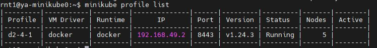
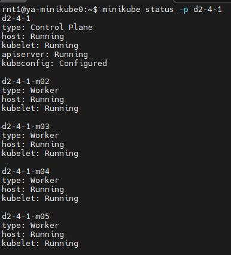

# Задание D2.4.1 практикума D2.4

1. Поднимал у себя локальный K8S-кластер с помощью Minikube используя команду:
  
minikube start --memory=max --cpus=max -p d2-4-1 -n=5 

в результате выполнения которой был создан профиль и кластер d2-4-1 из 5 нод

> Скриншот созданных профиля и кластера:

2. После того как ноды поднялись, получил список всех нод в локальном кластере с помощью команды:

minikube status -p d2-4-1 

> Скриншот вывода результата выполнения команды:
